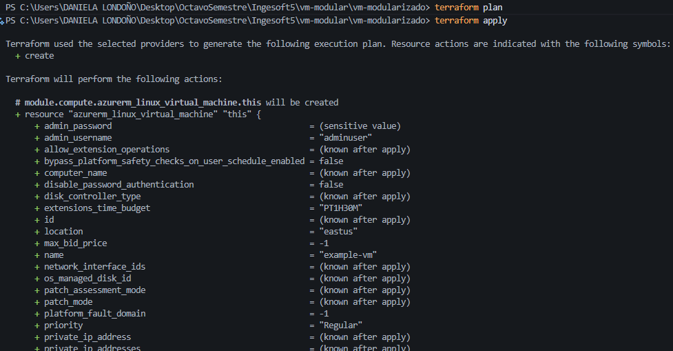
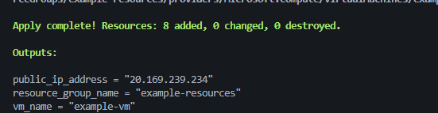
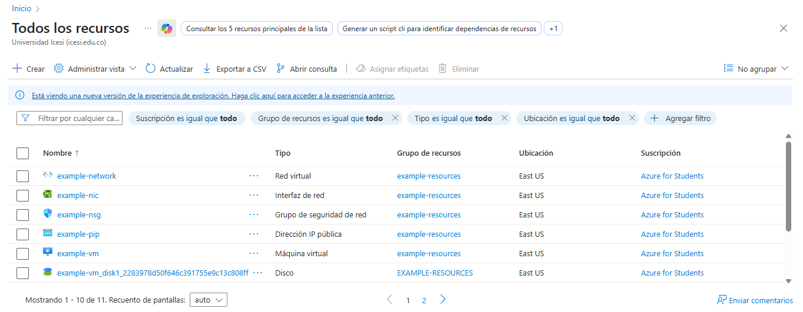
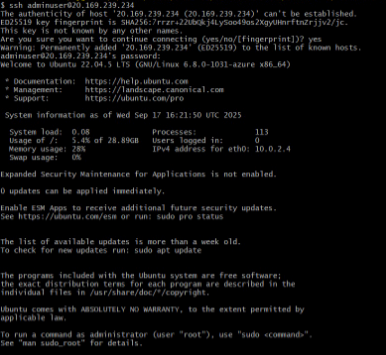

# Proyecto Terraform: VM en Azure (modularizado)

Leidy Daniela Londoño Candelo - A00392917

## Descripción de la actividad
Crear infraestructura en Microsoft Azure usando Terraform con un diseño modular. La actividad consiste en provisionar un Resource Group, la red (VNet, Subnet, NSG, IP pública, NIC) y una máquina virtual Linux mediante tres módulos reutilizables. El objetivo es practicar modularización, parametrización y buenas prácticas de infraestructura como código.

## Estructura del proyecto
- README.md
- main.tf
- variables.tf
- outputs.tf
- modules/
  - resource_group/
    - main.tf
    - variables.tf
    - outputs.tf
  - network/
    - main.tf
    - variables.tf
    - outputs.tf
  - compute/
    - main.tf
    - variables.tf
    - outputs.tf

## Beneficios de la modularización
- Reutilización: los módulos pueden usarse en otros proyectos.
- Mantenibilidad: cambios localizados en cada módulo.
- Legibilidad: separación clara de responsabilidades (RG, red, compute).
- Escalabilidad: fácil extensión (añadir módulos, por ejemplo, storage).
- Testabilidad: permite probar módulos de forma aislada.
- Colaboración: equipos pueden trabajar en módulos independientes.

## Prompt usado

> Actúa como un ingeniero DevOps experto en buenas prácticas de Terraform. Tengo un proyecto que permite desplegar una máquina virtual en Azure utilizando autenticación SSH (usuario-contraseña).
>Quiero que:
Dividas la infraestructura en módulos siguiendo buenas prácticas.
Mantengas únicamente los archivos necesarios: main.tf, variables.tf, outputs.tf.
Evites romper la configuración existente de Terraform.
Incluyas un archivo README.md donde expliques:
Qué cambios se realizaron.
La función de cada módulo.
Qué hace cada archivo (main, variables, outputs).

## Cambios realizados
- **Modularización**: infraestructura dividida en 3 módulos: `resource_group`, `network`, `compute`.
- **main.tf** ahora consume módulos y no define recursos directos.
- **Archivos raíz**: se mantienen `main.tf`, `variables.tf`, `outputs.tf` y este `README.md`.
- **Compatibilidad**: se preservan nombres, tamaños y parámetros por defecto para no romper la configuración existente.

### Función de cada módulo
- **modules/resource_group**: crea `azurerm_resource_group`.
  - Entradas: `prefix`, `location`.
  - Salidas: `name`, `location`.
- **modules/network**: crea VNet, Subnet, Public IP, NSG, NIC y asociación NIC-NSG.
  - Entradas: `prefix`, `location`, `resource_group_name`.
  - Salidas: `nic_id`, `public_ip_address`.
- **modules/compute**: crea `azurerm_linux_virtual_machine` con autenticación usuario/contraseña.
  - Entradas: `prefix`, `location`, `resource_group_name`, `admin_username`, `admin_password`, `nic_id`.
  - Salidas: `vm_name`.

### Qué hace cada archivo
- **main.tf**: declara el `provider` y orquesta los módulos `rg`, `network` y `compute`, encadenando entradas/salidas.
- **variables.tf**: variables de entrada (`prefix`, `location`, `admin_username`, `admin_password`).
- **outputs.tf**: expone salidas de los módulos (`vm_name`, `resource_group_name`, `public_ip_address`).

### Uso
1. Inicializar Terraform:
   ```bash
   terraform init
   ```
2. Ver plan de cambios:
   ```bash
   terraform plan
   ```
3. Aplicar:
   ```bash
   terraform apply
   ```

## Evidencia de implementación
- Terraform plan/aply



- Salida de `terraform output`



- Recurso en el Portal de Azure 



- Verificación de conectividad

